# Provide proUBC - Chainlink Fall Hackathon 2022 Entry
Provide submission for Chainlink Fall 2022 Hackathon with proUBC

## About
Decentralized Price Feeds for SAP S/4 HANA - powered by Chainlink, proUBC, PRVD, Shuttle and IPFS

This hackathon entry uses Chainlink price feeds in the SAP S/4 HANA Enterprise Resource Planning (ERP) system - with proUBC acting as the SAP - Web3 connector/SDK written in SAP ABAP. proUBC and SAP consumes Chainlink Price Feeds on public blockchain network such as Polygon via PRVD Nchain API. The received price feed results from Chainlink price feed are processed as updates to the TCURR table (which is used for all foreign currency conversions in SAP) and a custom reporting table in S/4 HANA. 

The introduction of Chainlink Price Feeds (as well as PRVD Baseline and IPFS!) to SAP introduces new opportunities to optimize and automate existing business processes. It also makes Web3 businesss integrations possible by giving SAP the necessary price information on digital assets it previously did not have.

Additionally - the user has the option to propagate PRVD Baseline zk-proofs to coordinate with other business partners to more broadly agree upon foreign exchange rate amongst several external SAP systems or other enterprise environments - without requiring all of them to have real-time connectivity to eachother.

Further - the user can choose to publish the results of the used price feed data to IPFS. The file on IPFS can also be shared amongst business partners. The file on IPFS could also be used as a new kind data source Chainlink Price Feeds could build upon by considering digital assets and currencies in their commercial use in fairly weighted criteria against current asset trading markets.

Check out our other entry materials for more info on the use case and a brief how-to.

## Entry materials
Video presentation:
TODO create 3-5 minute video walking through a demo
Slide deck:
https://docs.google.com/presentation/d/1UQpmbuvejSNI5Nu6fg7_4bZy9y8uVfwHQX4tlaK-wj4/edit?usp=sharing

## Dev Participants
Ryan Fleischmann (Developer)
Alex Dunne (Developer)

## How to implement
Prior to cloning this repo:
Clone the proUBC repo via abapGit
https://github.com/provideplatform/proUBC.git
(make sure to pull a branch dated after Nov 16 2022 for IPFS support)
Follow the the proUBC enablement docs to configure your SAP system for proUBC use:
https://docs.provide.services/proubc

THEN - clone this repo

### Onboard PRVD stack credentials, Configure the PRVD Chainlink Pricefeed Workflow
Go to https://shuttle.provide.services
Create an org and workgroup - using SAP as system of record as configured during initial proUBC enablement
Select any domain model
Manually Define the Price Feed Synchrozition Domain Model with the following properties
Domain model name: PRVDChainlinkPriceFeedSync
Fields
to_currency
from_currency 
formatted_amount
exchange_type 
rawanswer 
answeredinround 
roundid 
smartcontractaddress
networkid
dailypfkey

all with type string

See sample definition pictured below
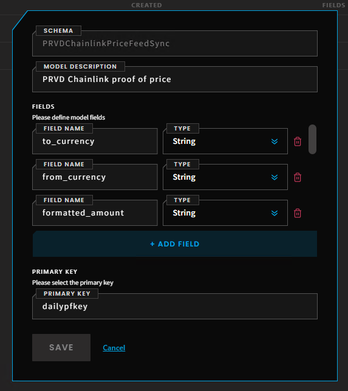

Note how the manual shuttle definition corresponds to the ABAP data type later used to emit the PRVD zk Proof
(Left: ABAP code to send ZK proof, Center: definition of the ABAP data type for the proof, Right: Shuttle domain model definition)
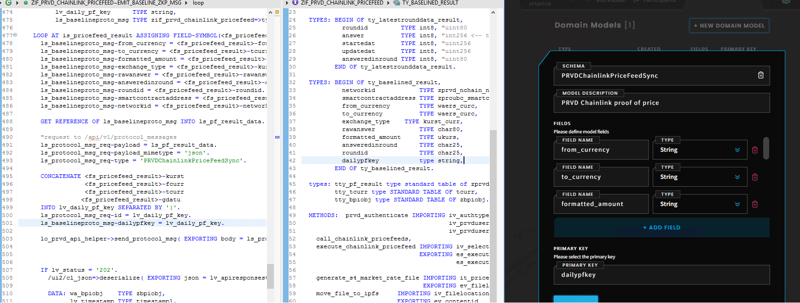

Complete onboarding in Shuttle
Define the Price Feed Synchronization Workflow as follows
Use the PRVDChainlinkPriceFeedSync domain model. Mark yes to requires finality. Deploy the workflow.
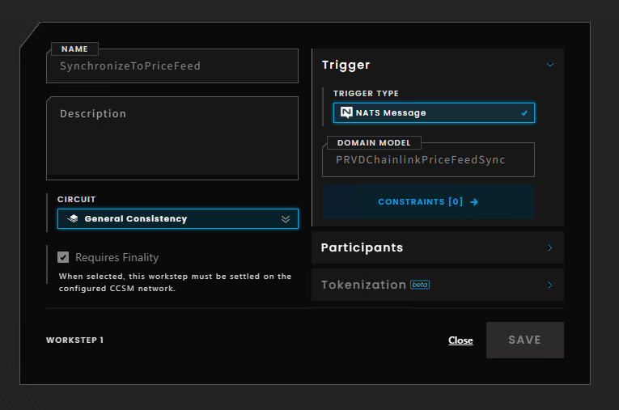

### Configure digital assets as currencies in S/4 HANA
Check out  https://erproof.com/fi/free-training/currencies-in-sap/ for general information on currency configuration in SAP

The last activity of tcode OB08 / maintenance of table TCURR is completed by this program via Chainlink Price Feeds

Check if your expected fiat currencies are here as well (ex: JPY and EUR)

### Configure data entries the Chainlink price feed smart contracts

You'll need to maintain some data linking Chainlink price feed contracts to given price pairs in SAP. Below are some recommended configurations for using Chainlink Price feeds from Polygon testnet/mainnet.

Configure table entries for your desired currency pairs in ZPRVDPRICEFEED
Currency 1 is your "from" currency (EUR, BTC, ETH)
Currency 2 is your "to" currency (e.g. USD)
Add a description as necessary
Pictured below is a sample entry in SE16 for ZPRVDPRICEFEED

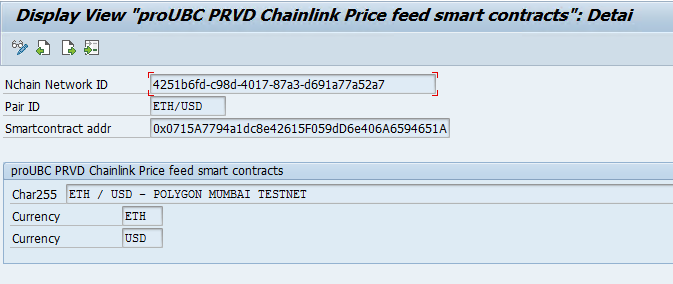

For the ETH/USD price feed on Polygon Mumbai Testnet use the following configuration entries
PRVD Nchain Network ID for Polygon Mumbai Testnet: 4251b6fd-c98d-4017-87a3-d691a77a52a7
ETH / USD Price Feed contract ID: 0x0715A7794a1dc8e42615F059dD6e406A6594651A

For the ETH/USD, EUR/USD, BTC/USD pricefeeds on the Polygon mainnets use the following configuration entries
PRVD Nchain Network ID for Polygon Mainnet: 2fd61fde-5031-41f1-86b8-8a72e2945ead
ETH / USD Price Feed contract ID: 0xF9680D99D6C9589e2a93a78A04A279e509205945 https://polygonscan.com/address/0xF9680D99D6C9589e2a93a78A04A279e509205945
EUR / USD Price Feed contract ID: 0x73366Fe0AA0Ded304479862808e02506FE556a98 https://polygonscan.com/address/0x73366Fe0AA0Ded304479862808e02506FE556a98
JPY / USD Price Feed contract ID: 0xD647a6fC9BC6402301583C91decC5989d8Bc382D https://polygonscan.com/address/0xD647a6fC9BC6402301583C91decC5989d8Bc382D
BTC / USD Price Feed contract ID: 0xc907E116054Ad103354f2D350FD2514433D57F6f https://polygonscan.com/address/0xc907E116054Ad103354f2D350FD2514433D57F6f
See https://docs.chain.link/docs/data-feeds/price-feeds/addresses/?network=polygon to verify and identify additional pricefeed

Upload an ABI file for Chainlink Price Feeds 
All price feed smart contracts used here have the same ABI defined - only need to upload once in this case. The needed ABI file can be downloaded from any of the block explorer pages for the price feed smart contracts listed above
Register the ABI file entries to ZPRVDABIREGISTRY. Create an entry in ZPRVDABIREGISTRY for each PRVD Network ID + Smart contract + ABI file registry.

Pictured below is a sample entry in SAP tcode SE16 for ZPRVDABIREGISTRY
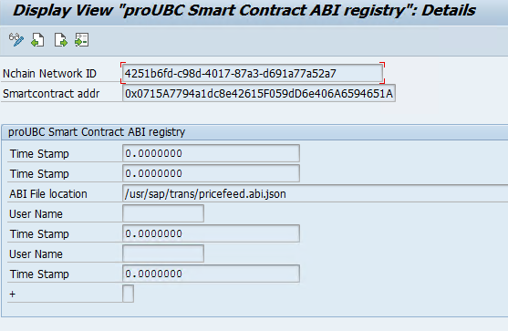

### IPFS setup

Infura is used in this example as an IPFS gateway provider. Create an IPFS project id and API key for authentication
Upload the relevant client and root certs in transaction code STRUST
Other IPFS gateway providers - including any self-hosted IPFS instances follow the same exact API standards. Authentication methods may vary.

## How to use
Open the program ZPRVD_CHAINLINK_PRICEFEED in transaction code SE38
Select your desired mainnet/testnet
Select your desired price pairs
(Optional) Specify your target PRVD credential (eg. Org+Workgroup+Subject account). Program will automatically resolve the credentials you created earlier if you leave blank
(Optional) Selecting "Create PRVD Baseline ZKP" will emit a PRVD Baseline zero knowledge proof
(Optional) Selecting "Share to IPFS" will generate a file representing the updated price feed information that will then be uploaded to IPFS. Use the IPFS project id and API as defined earlier

## Reviewing the results
The program output will look like the following
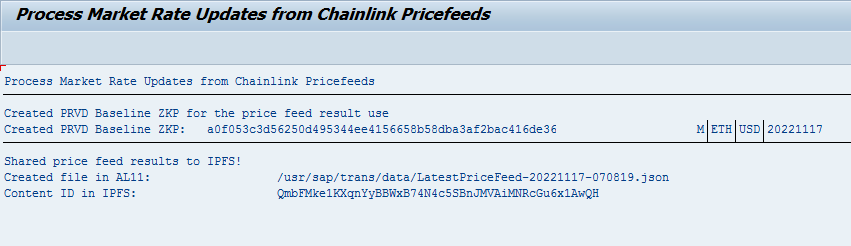
A new entries shall be created in the table ZPRVD_PF_RESULT
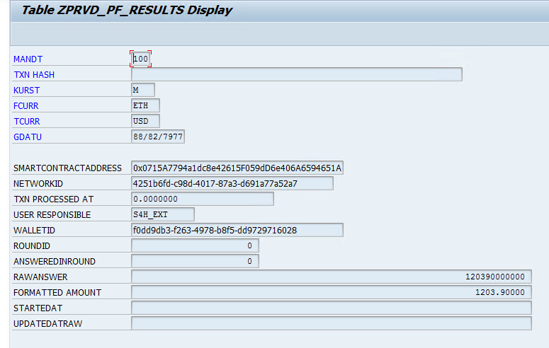
The standard SAP table TCURR shall be updated with the new currency rates
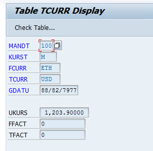
Check the console in Shuttle's workflow designer and the ZBPIOBJ table for the ZKP
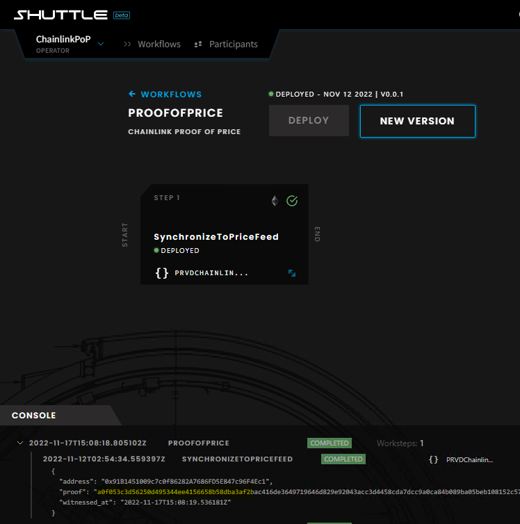
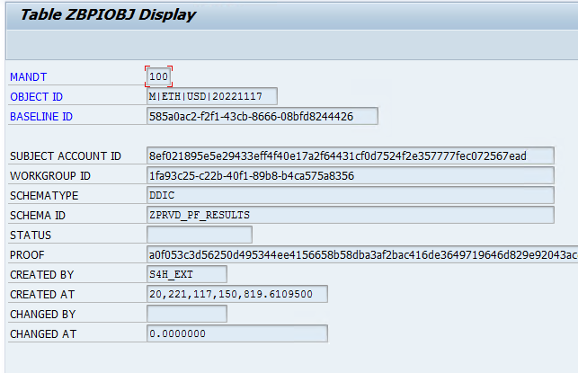
Check IPFS for the expected file under the given content ID. Same file should also be present in AL11 as indicated.
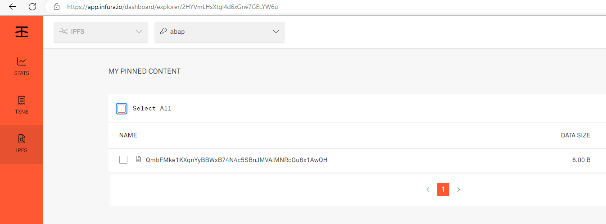
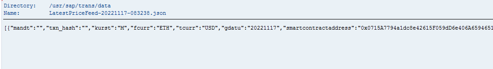

